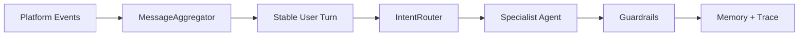

# Agent Best Practices Tutorial

这个文档把本项目当成教学项目来拆解：每一课都对应一个真实业务问题、一个 Agent 设计原则、一组代码文件和一组验证命令。

## 学习路线

1. 输入边界：连续消息聚合，避免事件流直接冲进 LLM。
2. 决策边界：意图路由、专家 Agent、确定性 guardrails。
3. 状态边界：SQLite 会话记忆、价格承诺单调更新。
4. 事实边界：商品知识库 RAG-lite，防止编造商品事实。
5. 可观测边界：AgentTrace、JSONL trace store、API trace 回查。
6. 质量边界：pytest、smoke、golden eval、CI gate。
7. 表达边界：真人化回复风格层，避免机器腔和客服腔。
8. 执行边界：回复 Outbox，防重复发送、可重试、可审计。
9. 产品边界：FastAPI service contract、人审、自动发货前确认。

## Lesson 1: 输入边界不是小事

真实闲鱼买家不会像 benchmark 一样一次输入完整问题。更常见的是：

```text
你好
128G 吗
3000 元能出吗
```

如果系统每收到一条消息就立刻调用 LLM，会出现三个问题：

- Agent 对“你好”先回复一次，打断买家的真实意图。
- 第二条规格问题和第三条报价问题被拆开，路由可能前后不一致。
- 记忆里写入多轮半截上下文，后续议价次数和价格承诺更容易污染。

最佳实践是把平台事件流先变成稳定的业务输入，再进入 Agent loop。



## 本课落地代码

- `core/message_aggregation.py`
  - 按 `chat_id + item_id + user_id` 隔离聚合窗口。
  - `debounce_seconds` 控制等待时间。
  - `max_messages` 和 `max_chars` 是安全阈值，避免无限等待或超长输入。
- `main.py`
  - live 模式收到买家消息后进入聚合窗口。
  - 人工接管、系统消息、过期消息仍然在聚合前过滤。
  - 聚合后的消息只触发一次 `XianyuReplyBot.generate_reply(...)`。
- `api/app.py`
  - `additional_user_msgs` 支持通过 HTTP API 演示连续消息合并。
- `tests/test_message_aggregation.py`
  - 验证同会话聚合、不同商品/买家隔离、达到上限立即 flush。
- `tests/test_api.py`
  - 验证连续消息合并后仍能识别 `price` 意图和买家报价。

## 为什么这是大厂 Agent 设计实践

一个可靠 Agent 不是“每条事件都问模型”，而是先把事件规整成可解释、可测试、可回放的 turn。

这层输入边界带来的工程价值：

- 降低 LLM 调用次数和成本。
- 减少重复回复，提高真人感。
- 让路由和 guardrails 面对完整上下文。
- 让记忆写入从“碎片事件”变成“业务轮次”。
- 可以用纯单元测试覆盖，不依赖真实闲鱼 Cookie。

## 如何验证本课

```bash
pytest tests/test_message_aggregation.py -q
pytest tests/test_api.py -q
python main.py --mode smoke
python tools/run_agent_eval.py --min-score 1.0
```

API 演示：

```bash
curl -X POST http://127.0.0.1:8000/api/reply ^
  -H "Content-Type: application/json" ^
  -d "{\"chat_id\":\"demo_batch\",\"item_id\":\"ipad\",\"user_msg\":\"你好\",\"additional_user_msgs\":[\"128G 吗\",\"3000 元能出吗\"]}"
```

你应该看到：

- `intent` 是 `price`。
- `price_decision.buyer_offer` 是 `3000`。
- memory 里只写入一轮用户消息和一轮助手回复。

## 面试讲法

我没有把平台消息直接喂给 LLM，而是在 Agent loop 前面设计了一层输入稳定化模块。它按会话、商品、买家隔离短窗口消息，将连续短消息合并为一个业务 turn，再进入意图路由、专家 Agent、guardrails 和 memory 写入。这样既减少模型调用，也避免半截上下文污染，同时这层逻辑是纯 Python 状态机，可以独立单测和通过 API 端到端验证。

## Lesson 2: 规则中心先于自动执行

如果目标是“自动客服到自动发货”，最危险的做法是让 LLM 自己记住所有商品规则，然后根据聊天内容直接决定发货。原因很直接：

- LLM 可能编造成功率、资格、售后承诺。
- 不同商品的发货条件不同，不能靠通用 prompt 混着管。
- 发货是高风险动作，必须先有可测试的“决策层”，再接真实发送工具。

最佳实践是把规则从 prompt 中抽离成结构化数据：

```text
商品规则中心
  -> 允许承诺
  -> 禁止承诺
  -> 售后/退款边界
  -> 发货触发条件
  -> 是否需要人工确认
  -> 交付话术模板
```

本项目对应文件：

- `data/product_rules.json`
  - 存储每个商品的承诺边界、退款规则、禁止承诺和发货规则。
- `core/product_rules.py`
  - `ProductRuleStore.resolve()`：按 `item_id` 或标题匹配商品规则。
  - `validate_reply()`：检查 LLM 回复是否包含禁止承诺。
  - `delivery_decision()`：根据订单状态判断是否可自动发货。
- `XianyuAgent.py`
  - 每轮回复前把规则中心注入 Agent 上下文。
  - 每轮回复后再次校验，违规承诺会被安全回复替换。
- `tests/test_product_rules.py`
  - 验证规则匹配、未付款不发货、虚拟教程付款后可交付、实物商品需要人工确认、违规承诺会被拦截。

这一课的核心原则：

```text
LLM 负责表达
规则负责边界
状态负责记忆
工具负责执行
测试负责证明
```

### 为什么不直接自动发货

现在的 `delivery_decision()` 只返回决策，不直接发消息。这是刻意设计：

- 决策层可以独立单测，不依赖真实闲鱼 Cookie。
- 执行层以后可以接 WebSocket、RPA、MCP 或人工确认队列。
- 一旦出错，可以从 trace 里看到“为什么允许/拒绝发货”。

### 如何验证本课

```bash
pytest tests/test_product_rules.py -q
python tools/run_agent_eval.py --min-score 1.0
```

你应该看到：

- `aliyun_coupon_300` 会匹配虚拟教程规则。
- 未付款状态返回 `wait_for_payment`。
- 已付款虚拟教程返回 `auto_deliver`。
- 实物 iPad 即使已付款，也返回 `manual_review`。
- 如果模型说出禁止承诺，最终回复会被规则护栏替换。

### 面试讲法

我没有把商品规则写死在 prompt，而是设计了商品规则中心。每个商品都有独立的允许承诺、禁止承诺、退款边界和发货策略。Agent 生成回复前会注入这些规则，生成后还会二次校验；如果出现违规承诺，会被安全回复替换。发货也不是由 LLM 直接执行，而是先由 `delivery_decision()` 根据订单状态和商品规则产出可审计决策，再由后续执行层处理。这让系统从“会聊天”升级为“可控交易 Agent”。

## Lesson 3: 真人感和自动执行都要工程化

自动操控闲鱼回复有两个很现实的问题：

- 回复像客服机器人，会降低买家信任，甚至暴露自动化痕迹。
- 平台 WebSocket 可能重复推送同一条消息，裸发会导致重复回复。

这两个问题都不能只靠“把 prompt 写好”。更稳的做法是把它们做成两层工程边界。


### 表达边界：HumanReplyStyler

`core/human_style.py` 做两件事：

- 生成前注入“真实个人卖家”的风格要求：短句、口语、先回答问题、不要营销文案。
- 生成后确定性清洗机器腔：例如“作为 AI 客服”“感谢咨询”“请问还有什么可以帮您”。

对应配置在 `data/human_reply_style.json`，可以按你的商品风格继续调。

### 执行边界：ReplyOutbox

`core/reply_outbox.py` 把“准备发送的回复”持久化到 SQLite：

- `pending`：已生成，等待发送。
- `sending`：已抢占发送权。
- `sent`：真实发送成功。
- `failed`：发送失败，允许后续重试。
- `skipped`：无需回复或 dry-run。

live 模式里，同一个买家源消息会先计算 `source_message_id` 和 `dedupe_key`。如果同一事件已处理过，系统会在进入 Agent 之前跳过，避免重复调用模型、重复写记忆、重复回复买家。

### 如何验证本课

```bash
pytest tests/test_human_style.py -q
pytest tests/test_reply_outbox.py -q
python main.py --mode smoke
```

你应该看到：

- 机器腔回复会被改写，trace 中出现 `human_reply_style` 和 `human_style_rewrite`。
- 同一个源消息只能 claim 一次发送权。
- 发送失败后可以再次 claim，形成可重试执行语义。

### 面试讲法

我没有只靠 prompt 让 Agent “像真人”，而是把表达风格做成可配置、可测试、可观测的后处理护栏。生成前提示模型用个人卖家口吻，生成后再检测和清洗机器腔表达，并把结果写入 trace。

同时，真实平台自动回复不能直接调用 send。我设计了 Reply Outbox：每条待发送回复先落库，再抢占发送权，发送成功/失败都有状态记录。这样 WebSocket 重连或重复同步不会造成重复回复，失败也可以重试。这是从 demo 走向生产级 Agent 的关键执行边界。
