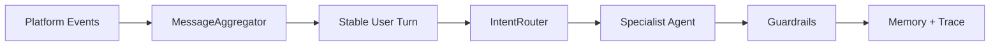

# Agent Best Practices Tutorial

这个文档把本项目当成教学项目来拆解：每一课都对应一个真实业务问题、一个 Agent 设计原则、一组代码文件和一组验证命令。

## 学习路线

1. 输入边界：连续消息聚合，避免事件流直接冲进 LLM。
2. 决策边界：意图路由、专家 Agent、确定性 guardrails。
3. 状态边界：SQLite 会话记忆、价格承诺单调更新。
4. 事实边界：商品知识库 RAG-lite，防止编造商品事实。
5. 可观测边界：AgentTrace、JSONL trace store、API trace 回查。
6. 质量边界：pytest、smoke、golden eval、CI gate。
7. 产品边界：FastAPI service contract、人审、自动发货前确认。

## Lesson 1: 输入边界不是小事

真实闲鱼买家不会像 benchmark 一样一次输入完整问题。更常见的是：

```text
你好
128G 吗
3000 元能出吗
```

如果系统每收到一条消息就立刻调用 LLM，会出现三个问题：

- Agent 对“你好”先回复一次，打断买家的真实意图。
- 第二条规格问题和第三条报价问题被拆开，路由可能前后不一致。
- 记忆里写入多轮半截上下文，后续议价次数和价格承诺更容易污染。

最佳实践是把平台事件流先变成稳定的业务输入，再进入 Agent loop。



## 本课落地代码

- `core/message_aggregation.py`
  - 按 `chat_id + item_id + user_id` 隔离聚合窗口。
  - `debounce_seconds` 控制等待时间。
  - `max_messages` 和 `max_chars` 是安全阈值，避免无限等待或超长输入。
- `main.py`
  - live 模式收到买家消息后进入聚合窗口。
  - 人工接管、系统消息、过期消息仍然在聚合前过滤。
  - 聚合后的消息只触发一次 `XianyuReplyBot.generate_reply(...)`。
- `api/app.py`
  - `additional_user_msgs` 支持通过 HTTP API 演示连续消息合并。
- `tests/test_message_aggregation.py`
  - 验证同会话聚合、不同商品/买家隔离、达到上限立即 flush。
- `tests/test_api.py`
  - 验证连续消息合并后仍能识别 `price` 意图和买家报价。

## 为什么这是大厂 Agent 设计实践

一个可靠 Agent 不是“每条事件都问模型”，而是先把事件规整成可解释、可测试、可回放的 turn。

这层输入边界带来的工程价值：

- 降低 LLM 调用次数和成本。
- 减少重复回复，提高真人感。
- 让路由和 guardrails 面对完整上下文。
- 让记忆写入从“碎片事件”变成“业务轮次”。
- 可以用纯单元测试覆盖，不依赖真实闲鱼 Cookie。

## 如何验证本课

```bash
pytest tests/test_message_aggregation.py -q
pytest tests/test_api.py -q
python main.py --mode smoke
python tools/run_agent_eval.py --min-score 1.0
```

API 演示：

```bash
curl -X POST http://127.0.0.1:8000/api/reply ^
  -H "Content-Type: application/json" ^
  -d "{\"chat_id\":\"demo_batch\",\"item_id\":\"ipad\",\"user_msg\":\"你好\",\"additional_user_msgs\":[\"128G 吗\",\"3000 元能出吗\"]}"
```

你应该看到：

- `intent` 是 `price`。
- `price_decision.buyer_offer` 是 `3000`。
- memory 里只写入一轮用户消息和一轮助手回复。

## 面试讲法

我没有把平台消息直接喂给 LLM，而是在 Agent loop 前面设计了一层输入稳定化模块。它按会话、商品、买家隔离短窗口消息，将连续短消息合并为一个业务 turn，再进入意图路由、专家 Agent、guardrails 和 memory 写入。这样既减少模型调用，也避免半截上下文污染，同时这层逻辑是纯 Python 状态机，可以独立单测和通过 API 端到端验证。
