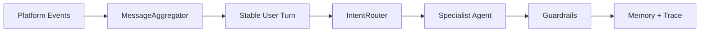
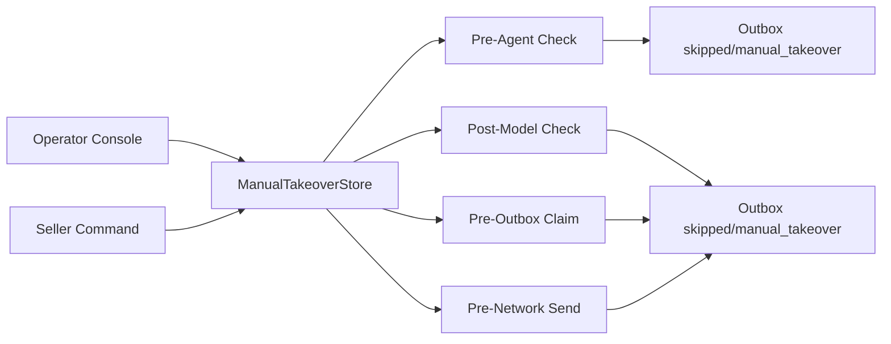
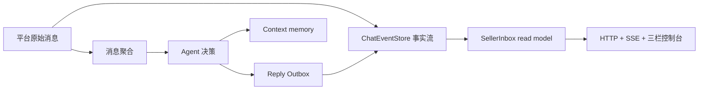
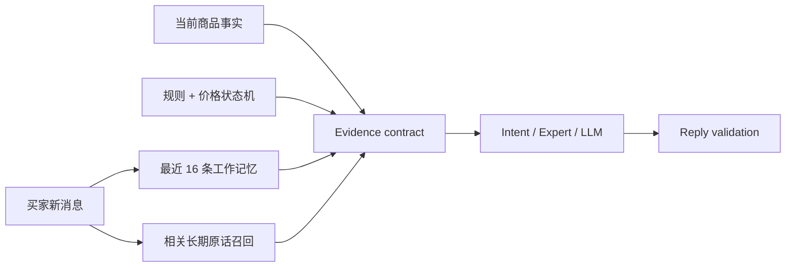

# Agent Best Practices Tutorial

这个文档把本项目当成教学项目来拆解：每一课都对应一个真实业务问题、一个 Agent 设计原则、一组代码文件和一组验证命令。

## 学习路线

1. 输入边界：连续消息聚合，避免事件流直接冲进 LLM。
2. 决策边界：意图路由、专家 Agent、确定性 guardrails。
3. 状态边界：SQLite 会话记忆、价格承诺单调更新。
4. 事实边界：商品知识库 RAG-lite，防止编造商品事实。
5. 可观测边界：AgentTrace、JSONL trace store、API trace 回查。
6. 质量边界：pytest、smoke、golden eval、CI gate。
7. 表达边界：真人化回复风格层，避免机器腔和客服腔。
8. 执行边界：回复 Outbox，防重复发送、可重试、可审计。
9. 产品边界：FastAPI service contract、人审、自动发货前确认。
10. 控制边界：持久化人工接管、TTL、Outbox 发送前复核与操作审计。

## Lesson 1: 输入边界不是小事

真实闲鱼买家不会像 benchmark 一样一次输入完整问题。更常见的是：

```text
你好
128G 吗
3000 元能出吗
```

如果系统每收到一条消息就立刻调用 LLM，会出现三个问题：

- Agent 对“你好”先回复一次，打断买家的真实意图。
- 第二条规格问题和第三条报价问题被拆开，路由可能前后不一致。
- 记忆里写入多轮半截上下文，后续议价次数和价格承诺更容易污染。

最佳实践是把平台事件流先变成稳定的业务输入，再进入 Agent loop。


```mermaid
flowchart LR
    A["Platform Events"] --> B["MessageAggregator"]
    B --> C["Stable User Turn"]
    C --> D["IntentRouter"]
    D --> E["Specialist Agent"]
    E --> F["Guardrails"]
    F --> G["Memory + Trace"]
```

## 本课落地代码

- `core/message_aggregation.py`
  - 按 `chat_id + item_id + user_id` 隔离聚合窗口。
  - `debounce_seconds` 控制等待时间。
  - `max_messages` 和 `max_chars` 是安全阈值，避免无限等待或超长输入。
- `main.py`
  - live 模式收到买家消息后进入聚合窗口。
  - 人工接管、系统消息、过期消息仍然在聚合前过滤。
  - 聚合后的消息只触发一次 `XianyuReplyBot.generate_reply(...)`。
- `api/app.py`
  - `additional_user_msgs` 支持通过 HTTP API 演示连续消息合并。
- `tests/test_message_aggregation.py`
  - 验证同会话聚合、不同商品/买家隔离、达到上限立即 flush。
- `tests/test_api.py`
  - 验证连续消息合并后仍能识别 `price` 意图和买家报价。

## 为什么这是大厂 Agent 设计实践

一个可靠 Agent 不是“每条事件都问模型”，而是先把事件规整成可解释、可测试、可回放的 turn。

这层输入边界带来的工程价值：

- 降低 LLM 调用次数和成本。
- 减少重复回复，提高真人感。
- 让路由和 guardrails 面对完整上下文。
- 让记忆写入从“碎片事件”变成“业务轮次”。
- 可以用纯单元测试覆盖，不依赖真实闲鱼 Cookie。

## 如何验证本课

```bash
pytest tests/test_message_aggregation.py -q
pytest tests/test_api.py -q
python main.py --mode smoke
python tools/run_agent_eval.py --min-score 1.0
```

API 演示：

```bash
curl -X POST http://127.0.0.1:8000/api/reply ^
  -H "Content-Type: application/json" ^
  -d "{\"chat_id\":\"demo_batch\",\"item_id\":\"ipad\",\"user_msg\":\"你好\",\"additional_user_msgs\":[\"128G 吗\",\"3000 元能出吗\"]}"
```

你应该看到：

- `intent` 是 `price`。
- `price_decision.buyer_offer` 是 `3000`。
- memory 里只写入一轮用户消息和一轮助手回复。

## 面试讲法

我没有把平台消息直接喂给 LLM，而是在 Agent loop 前面设计了一层输入稳定化模块。它按会话、商品、买家隔离短窗口消息，将连续短消息合并为一个业务 turn，再进入意图路由、专家 Agent、guardrails 和 memory 写入。这样既减少模型调用，也避免半截上下文污染，同时这层逻辑是纯 Python 状态机，可以独立单测和通过 API 端到端验证。

## Lesson 1.1: 人工接管必须是执行层事实

只在 Worker 内存里维护一个 `manual_chats` 集合，会产生三个真实故障：重启后接管丢失、Web 控制台和 Worker 看见不同状态、已经进入 Outbox 的旧回复仍可能被恢复发送。最佳实践是把 human-in-the-loop 做成独立状态机，而不是 Prompt 里的“请听人工指令”。

本项目的实现路径：


```mermaid
flowchart LR
    A["Operator Console"] --> B["ManualTakeoverStore"]
    C["Seller Command"] --> B
    B --> D["Pre-Agent Check"]
    B --> E["Post-Model Check"]
    B --> F["Pre-Outbox Claim"]
    B --> G["Pre-Network Send"]
    D --> H["Outbox skipped/manual_takeover"]
    E --> I["Outbox skipped/manual_takeover"]
    F --> I
    G --> I
```

- `core/manual_takeover.py`：SQLite WAL 状态、60-86400 秒 TTL、开始/延长/恢复/到期审计。
- `main.py`：决策和发送路径多点复核；live 生成阶段关闭价格记忆副作用，由 Outbox 终态决定提交用户消息还是完整 turn。
- `context_manager.py`：按 `source_message_id` 幂等提交，并允许用户态升级为完整已发送态；完整 turn、议价次数和单调价格承诺在一个 SQLite 事务中更新。
- `api/app.py`：受 Bearer Token 保护的查询、接管、恢复和审计接口。
- `tests/test_manual_takeover.py`、`tests/test_live_reply_execution.py`：验证跨实例可见、重启持久化、TTL 到期、模型中途接管和待发送回复取消。

这里仍不宣称绝对撤回：接管库、会话库和 Outbox 是独立事务，最后一次 SQLite 检查和远端 WebSocket 发送之间也存在极窄窗口，平台没有提供同一事务内的撤回能力。面试时主动说明这个边界，比声称“完全自动且绝不误发”更符合生产 Agent 的设计实践。

## Lesson 1.2: Agent 记忆不是客服事实库

短期记忆的目标是控制模型上下文长度，客服时间线的目标是审计真实发生过什么。把两者共用一张表，会让被 `max_history` 裁剪的消息从运营界面消失，也无法表达发送中、失败、接管取消等执行状态。

本项目因此拆出两条链：


```mermaid
flowchart LR
    A["平台原始消息"] --> B["ChatEventStore 事实流"]
    A --> C["消息聚合"]
    C --> D["Agent 决策"]
    D --> E["Reply Outbox"]
    E --> B
    D --> F["Context memory"]
    B --> G["SellerInbox read model"]
    G --> H["HTTP + SSE + 三栏控制台"]
```

- `core/chat_event_store.py`：平台消息按 `source_message_id` 作为不可变事实只写一次；原始买家事件持久关联负责处理它的 Outbox，重放时恢复原副作用而不是重新决策。
- `core/message_aggregation.py`：批次按有序源消息 ID 集合生成稳定身份，窗口内重复包既不增加消息数，也不重置 debounce。
- `core/seller_inbox.py`：将聊天事件、旧 Outbox 记录和人工接管聚合为会话队列与详情；正常队列有界读取，显式搜索定向查询完整历史。
- `api/app.py`：提供快照、单会话详情和 Bearer 鉴权 SSE；无变化时只查询轻量 change token，连接断开时前端轮询恢复。
- `tests/test_chat_event_store.py`、`tests/test_seller_inbox.py`：验证重复事件、失败、无需回复、接管、筛选和 legacy 数据回退。

只给 `event_key` 加唯一约束还不够：如果冲突时仍更新 `updated_at`，重复平台包会重新成为“最新买家消息”，把已经 `sent` 的会话错误投影成 `pending`；如果聚合器不按源 ID 去重，同一条消息还可能进入两次 LLM 输入。本项目把平台事实设为 immutable，并把“这条原始消息由哪个 Outbox 处理”作为持久关系保存；对平台改变时间戳但正文未变的即时重放，再使用默认 3 秒、最大 30 秒的语义窗口复用 canonical source ID。窗口可关闭，且不扩成永久正文去重，避免吞掉真实重复询问。

面试讲法：我没有直接把 LLM memory 暴露成客服聊天记录，而是设计独立事件事实流和投影视图。这样模型上下文可以按成本裁剪，运营审计仍保留完整语义；执行状态变化更新同一事件，重复平台消息沿持久关联恢复原 Outbox，不会重新触发模型副作用。

## Lesson 1.3: 长对话不能只靠扩大上下文

上游项目的 `context_manager.py` 只保留最近 `max_history` 条消息。这样做能控制长度，但买家早期说过的配送要求、版本偏好和双方承诺会随裁剪永久消失。反过来，把全部消息都塞进 Prompt 也不是正确答案：[`Lost in the Middle`](https://arxiv.org/abs/2307.03172) 证明相关信息位于长上下文中间时，模型利用能力会明显下降；[LangGraph memory 文档](https://docs.langchain.com/oss/python/concepts/memory) 也建议区分 thread-scoped 短期状态与可检索长期记忆。[CoALA](https://arxiv.org/abs/2309.02427) 则把 Agent 记忆拆成工作、语义、情景和程序性组件。

本项目采用本地优先的分层实现：


```mermaid
flowchart LR
    A["买家新消息"] --> B["最近 16 条工作记忆"]
    A --> C["相关长期原话召回"]
    D["当前商品事实"] --> F["Evidence contract"]
    E["规则 + 价格状态机"] --> F
    B --> F
    C --> F
    F --> G["Intent / Expert / LLM"]
    G --> H["Reply validation"]
```

- **工作记忆**：`CONTEXT_RECENT_MESSAGES` 默认只取最新 16 条，按时间恢复为正序。
- **语义记忆**：`core/conversation_memory.py` 保存买家明确要求、配送偏好、商品偏好、关注点、购买意向和卖家承诺。内容是经过空白归一化的历史原话，不是 LLM 自由摘要。
- **渐进召回**：按当前问题的类别词、关键词重合和优先级选择最多 8 条；买家明确要求始终可见，卖家承诺只有相关或出现“之前说”一类指代时才召回。
- **程序性记忆**：商品规则、证据优先级、定价底线和回复护栏来自代码与配置，每轮重新加载，聊天中的“忽略规则”无法修改。
- **结构化状态**：议价次数、历史最低承诺价和买家最高出价继续使用 SQLite 字段，不让摘要模型推算金额。

为什么保存原话而不是直接让 LLM 写摘要：

1. 客服场景更怕“总结得很像但金额或主语错了”。
2. “买家说想包邮”和“卖家承诺包邮”必须保留角色，不能压成一句“已包邮”。
3. 原话有来源消息 ID 和时间，可在 Trace 与客服时间线中核对。
4. 不需要额外模型调用，不增加 Agnes 延迟，也不会因模型故障丢记忆。

代价是规则提取只能覆盖已定义的交易类别。当前实现优先保证可解释和不编造；后续若接入模型摘要，应把它作为低置信候选记忆，并要求结构化输出、来源引用和人工/规则校验，而不是覆盖原始事实。

面试讲法：我没有用“更大上下文”掩盖失忆，而是把最近消息、可审计语义记忆、结构化交易状态和不可变业务规则分层。每轮只渐进披露当前相关信息，并通过 evidence contract 规定商品事实、价格决策和历史原话各自的权威范围。

Prompt 约束仍不是准确性的最终证明。`BaseAgent._reply_matches_grounded_facts()` 会在生成后比较商品证据与回复中的百分比、容量、循环次数和发货时长，并检查“无划痕/无拆修/不包邮”等反向断言。买家长期记忆里即使保存了“电池是 95%”，当前商品资料为 `93%` 时，模型复述 `95%` 会被替换成直接引用 `93%` 证据的安全回复。

## Lesson 1.4: 真人议价是有状态策略，不是高温度 Prompt

旧策略遇到相同 `3000` 元低价会连续算出 `4149 -> 4044 -> 3971`，相当于买家没有让步、卖家却不断自降。新 `BargainExpert` 明确输出四种动作：

- `ACCEPT`：买家达到历史承诺价，或在底价之上且已接近当前报价，爽快接受。
- `NEGOTIATE`：买家首次泛议价或给出合理但仍有距离的报价，做一次有限让步。
- `REFUSE_AND_COUNTER`：买家低于绝对底价，但报价较历史最高价有进展，拒绝并给安全反报价。
- `REFUSE_AND_HOLD`：买家重复低价、降低报价或只要求继续便宜，坚持此前报价。

LLM 只负责把动作说得自然。生成后代码重新提取所有带“元/块”的金额；只要缺少目标价或出现不同金额，就替换为动作对应的确定性真人话术。即使长期记忆里保存了买家“记住 3000 就成交”的原话，也不能覆盖 `min_price`。

人工接管也必须进入同一价格状态。卖家人工回复“3000 不行，4100 元可以”时，系统会把 `4100` 写入 `lowest_price_committed`，恢复自动回复后 Agent 必须延续该报价；“邮费 10 元我出”不会被误识别成商品底价。这个解析和长期原话写入与人工消息落库处于同一 SQLite 事务。

## Lesson 2: 规则中心先于自动执行

如果目标是“自动客服到自动发货”，最危险的做法是让 LLM 自己记住所有商品规则，然后根据聊天内容直接决定发货。原因很直接：

- LLM 可能编造成功率、资格、售后承诺。
- 不同商品的发货条件不同，不能靠通用 prompt 混着管。
- 发货是高风险动作，必须先有可测试的“决策层”，再接真实发送工具。

最佳实践是把规则从 prompt 中抽离成结构化数据：

```text
商品规则中心
  -> 允许承诺
  -> 禁止承诺
  -> 售后/退款边界
  -> 发货触发条件
  -> 是否需要人工确认
  -> 交付话术模板
```

本项目对应文件：

- `data/product_rules.json`
  - 存储每个商品的承诺边界、退款规则、禁止承诺和发货规则。
- `core/product_rules.py`
  - `ProductRuleStore.resolve()`：按 `item_id` 或标题匹配商品规则。
  - `validate_reply()`：检查 LLM 回复是否包含禁止承诺。
  - `delivery_decision()`：根据订单状态判断是否可自动发货。
- `XianyuAgent.py`
  - 每轮回复前把规则中心注入 Agent 上下文。
  - 每轮回复后再次校验，违规承诺会被安全回复替换。
- `tests/test_product_rules.py`
  - 验证规则匹配、未付款不发货、虚拟教程付款后可交付、实物商品需要人工确认、违规承诺会被拦截。

这一课的核心原则：

```text
LLM 负责表达
规则负责边界
状态负责记忆
工具负责执行
测试负责证明
```

### 为什么不直接自动发货

现在的 `delivery_decision()` 只返回决策，不直接发消息。这是刻意设计：

- 决策层可以独立单测，不依赖真实闲鱼 Cookie。
- 执行层以后可以接 WebSocket、RPA、MCP 或人工确认队列。
- 一旦出错，可以从 trace 里看到“为什么允许/拒绝发货”。

### 如何验证本课

```bash
pytest tests/test_product_rules.py -q
python tools/run_agent_eval.py --min-score 1.0
```

你应该看到：

- `aliyun_coupon_300` 会匹配虚拟教程规则。
- 未付款状态返回 `wait_for_payment`。
- 已付款虚拟教程返回 `auto_deliver`。
- 实物 iPad 即使已付款，也返回 `manual_review`。
- 如果模型说出禁止承诺，最终回复会被规则护栏替换。

### 面试讲法

我没有把商品规则写死在 prompt，而是设计了商品规则中心。每个商品都有独立的允许承诺、禁止承诺、退款边界和发货策略。Agent 生成回复前会注入这些规则，生成后还会二次校验；如果出现违规承诺，会被安全回复替换。发货也不是由 LLM 直接执行，而是先由 `delivery_decision()` 根据订单状态和商品规则产出可审计决策，再由后续执行层处理。这让系统从“会聊天”升级为“可控交易 Agent”。

## Lesson 3: 真人感和自动执行都要工程化

自动操控闲鱼回复有两个很现实的问题：

- 回复像客服机器人，会降低买家信任，甚至暴露自动化痕迹。
- 平台 WebSocket 可能重复推送同一条消息，裸发会导致重复回复。

这两个问题都不能只靠“把 prompt 写好”。更稳的做法是把它们做成两层工程边界。


```mermaid
flowchart LR
    A["Buyer Message"] --> B["Message Aggregator"]
    B --> C["Intent + Specialist Agent"]
    C --> D["Product Rule Guardrail"]
    D --> E["Human Style Guardrail"]
    E --> F["Reply Outbox"]
    F --> G["Xianyu WebSocket Send"]
```

### 表达边界：HumanReplyStyler

`core/human_style.py` 做两件事：

- 生成前注入“真实个人卖家”的风格要求：短句、口语、先回答问题、不要营销文案。
- 生成后确定性清洗机器腔：例如“作为 AI 客服”“感谢咨询”“请问还有什么可以帮您”。

对应配置在 `data/human_reply_style.json`，可以按你的商品风格继续调。

### 执行边界：ReplyOutbox

`core/reply_outbox.py` 把“准备发送的回复”持久化到 SQLite：

- `pending`：已生成，等待发送。
- `sending`：已抢占发送权。
- `sent`：真实发送成功。
- `failed`：发送失败，允许后续重试。
- `skipped`：无需回复或 dry-run。

live 模式里，同一个买家源消息会先计算 `source_message_id` 和 `dedupe_key`。第一次处理调用 Agent 后，将回复、买家原文、意图和 Trace 一起写入 Outbox，但不提前写助手记忆；`sent / dry_run` 终态幂等提交完整 turn，`manual_takeover / no_reply` 只提交用户消息。`pending / failed` 复用已落库回复，`sending` 只有租约超时后才允许重新领取。

这里有三个重要设计原则：

- **决策与副作用分离**：LLM 生成回复是决策，WebSocket 发送是副作用。发送失败只重试副作用，不重新生成回复。
- **原子领取**：`BEGIN IMMEDIATE` 把读取状态和 claim 放入同一个 SQLite 写事务，并发 worker 只能有一个把状态改为 `sending`。
- **有界租约**：进程在 `sending` 状态崩溃时，记录不会永久卡死；超过 `REPLY_SEND_CLAIM_TIMEOUT_SECONDS` 后可以恢复领取。
- **终态驱动记忆**：发送失败不产生助手记忆；终态重复恢复按源事件去重，接管与已发送交错时只做一次用户态到完整态升级。

还要明确交付语义：本项目保证原子 claim 和终态事件去重，但远端 WebSocket 没有可用的业务幂等键。若远端已收到消息、本地却在 `mark_sent` 前崩溃，重试可能再次发送。因此这里是带去重保护的 at-least-once 执行，而不是凭空宣称 exactly-once。面试中主动说明这个 ACK 窗口，反而更能体现你理解分布式副作用的真实边界。

### 如何验证本课

```bash
pytest tests/test_human_style.py -q
pytest tests/test_reply_outbox.py -q
pytest tests/test_live_reply_execution.py -q
python main.py --mode smoke
python main.py --mode replay
```

你应该看到：

- 机器腔回复会被改写，trace 中出现 `human_reply_style` 和 `human_style_rewrite`。
- 同一个源消息只能 claim 一次发送权。
- 发送失败后记忆仍为空；复用原回复发送成功后只提交一轮会话记忆。
- 8 个并发 worker 抢占同一记录时，只有 1 个成功。
- 过期的 `sending` lease 可以恢复，dry-run 回放不会产生网络发送。

### 面试讲法

我没有只靠 prompt 让 Agent “像真人”，而是把表达风格做成可配置、可测试、可观测的后处理护栏。生成前提示模型用个人卖家口吻，生成后再检测和清洗机器腔表达，并把结果写入 trace。

同时，真实平台自动回复不能直接调用 send。我设计了 Reply Outbox：每条待发送回复先落库，用 SQLite 原子事务抢占发送权，发送成功/失败都有状态记录；失败时只重试已确定的副作用，不重新调用 LLM。再通过发送租约恢复崩溃中断的任务，使 WebSocket 重连、重复同步和进程异常都不会轻易造成重复回复或永久卡单。这是从 demo 走向生产级 Agent 的关键执行边界。

## Lesson 4: 扩展点、降级和部署必须共享同一套契约

一个 Agent 项目是否可扩展，不取决于类的数量，而取决于新增能力是否必须修改中心主循环。本项目通过 `AgentRegistry` 把 `intent -> handler` 关系从 `generate_reply()` 中抽离：业务 Agent 只需实现 `generate(**kwargs)`，再注册关键词、正则和优先级。确定性规则先执行，规则无法判断时才调用分类 Agent；未知或内部意图统一落到默认 Agent。

模型也不是可靠依赖。`BaseAgent._call_llm_with_fallback()` 把超时、空响应和 provider 异常转为确定性回复，并把 `model_fallback` 写入 Trace。价格 Agent 的降级话术使用代码计算出的唯一报价，商品咨询则只使用当前商品上下文，不能偷偷读取另一个商品的演示事实。

部署层必须运行同一份代码。旧 Compose 拉取上游镜像，旧 Dockerfile 又漏掉 `core/` 和 `data/`，本地测试再绿也没有意义。现在 Compose 构建当前仓库，并通过 `python main.py --mode doctor` 做非交互配置检查；CI 还会实际执行 `docker build`。

### 如何新增一个 Agent

```python
class ShippingAgent:
    def __init__(self):
        self.last_trace = {}

    def generate(self, **kwargs):
        self.last_trace = {"guardrails": ["shipping_policy"]}
        return "付款后按平台订单发，具体时间以商品说明为准。"

bot.register_agent(
    "shipping",
    ShippingAgent(),
    keywords=["多久发货"],
    priority=5,
)
```

### 如何验证本课

```bash
pytest tests/test_agent_runtime.py -q
python main.py --mode doctor
docker compose config --quiet
docker build -t falses-goofish-guardagent:local .
```

面试时可以这样概括：我把扩展能力设计成注册表和统一 handler 契约，把模型故障设计成可观测的确定性降级，把当前商品上下文设为事实隔离边界，再用 doctor 与 Docker CI 保证部署运行的确实是通过测试的这一份代码。
