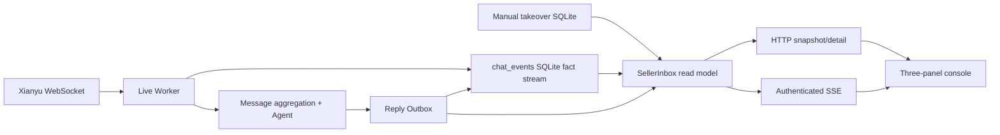

# Realtime Seller Inbox Research

调研日期：2026-07-29。目标不是按截图仿制，而是确认哪些项目真实提供启动链路、消息通道和运营交互，再把可验证模式改写为当前仓库自己的轻量实现。

## 1. 可运行项目核验

| 项目 | 核验时状态 | 运行证据 | 借鉴点 | 明确不照搬 |
| --- | --- | --- | --- | --- |
| [zhinianboke/xianyu-auto-reply](https://github.com/zhinianboke/xianyu-auto-reply) | 6k+ stars，2026-07-29 仍更新，AGPL | README 提供部署脚本；源码包含 React/Vite 前端、FastAPI API、WebSocket 与 scheduler 服务 | `ChatNew.tsx` 的账号、会话列表、消息线程、工具/订单多栏结构；HTTP 首屏 + WebSocket 增量；未读与消息去重 | 不复制 AGPL 代码；当前项目暂不引入 MySQL/Redis、多账号和网页直发 |
| [GuDong2003/xianyu-auto-reply-fix](https://github.com/GuDong2003/xianyu-auto-reply-fix) | 1.9k+ stars，v2.0.5 发布于 2026-07-10 | README 提供 Docker Compose 和本地 `python Start.py`；包含健康检查和安全修复 | SQLite 部署、健康状态、账号与自动回复后台的工程化边界 | 不继承默认账号、远程脚本或无法独立审计的发布链 |
| [Usagi-org/ai-goofish-monitor](https://github.com/Usagi-org/ai-goofish-monitor) | 14k+ stars，MIT，已归档；2.4 发布于 2026-04-27 | README 提供 Docker 与 Uvicorn 启动，默认 UI `127.0.0.1:8000` | 日志 WebSocket 重连、任务选择、自动刷新、自动滚动、向前加载时保持滚动位置 | 它是买家侧商品监控，不把搜索任务误当卖家客服会话 |
| [shaxiu/XianyuAutoAgent](https://github.com/shaxiu/XianyuAutoAgent) | 8k+ stars，2026-06-10 有更新 | README 提供 Python / `.env` / 模型配置与 live 启动 | 意图分类到议价、技术、默认专家的路由；上下文与人工切换 | 缺少 Web 运营台和持久化接管，不能直接作为控制面实现 |
| [11273/goofish-client](https://github.com/11273/goofish-client) | v1.4.0，2026-07 仍有安全更新，GPL-3.0 | npm 包和 README 示例覆盖二维码登录、IM token、WebSocket、格式化消息和文本发送 | 把平台协议隔离为 adapter 的方向 | SDK 不是成品后台；当前 Python 协议层不因 UI 改造而替换 |
| [chatwoot/chatwoot](https://github.com/chatwoot/chatwoot) | 34k+ stars，2026-07-29 活跃 | 官方仓库和文档提供 unified inbox / live view | attention queue、选中会话、右侧客户上下文、标签筛选、快捷操作 | 不引入其完整 Rails/Vue 多租户系统 |

补充的成熟客服交互资料：

- [Microsoft Dynamics 365 Customer Service inbox](https://learn.microsoft.com/en-us/dynamics365/customer-service/use/use-inbox)：以 assignment、状态和队列组织待处理会话。
- [Intercom Inbox](https://www.intercom.com/helpdesk/inbox)：列表、会话和详情上下文共同构成客服主工作区。
- [HighLevel Conversations](https://help.gohighlevel.com/support/solutions/articles/155000006610-getting-started-with-the-conversations-tab)：明确展示 conversations 的多面板工作方式。

## 2. 采用的交互决策

1. 默认入口从聚合 Dashboard 改为实时 Inbox。客服首先处理具体会话，再看报表。
2. 桌面固定为队列、时间线、上下文三栏；移动端使用显式三段 tab，不把三块内容纵向堆成超长页面。
3. 队列状态只来自真实事件、Outbox 和接管状态，不伪造平台未读数、成交额或在线人数。
4. 选中会话后保持 selection；新事件到达时仅在操作者接近底部时自动滚动，避免阅读历史时被抢走位置。
5. 人工接管放在会话头部。恢复自动回复保留确认，因为它会重新启用买家侧副作用。
6. 全局搜索优先查会话；Trace 仍保留自己的审计筛选。

## 3. 数据与实时架构

- `chat_events` 是客服事实流；买家原始消息在聚合前写入，卖家人工消息和 Agent 回复分别标注 role / direction。
- `messages` 继续是 Agent 短期记忆，可以裁剪；运营时间线不再错误依赖它。
- Outbox 的 `pending / sending / sent / failed / skipped` 更新同一 assistant event，避免状态变化生成重复气泡。
- `SellerInbox` 同时兼容升级前的 legacy Outbox，使已有自动回复记录无需迁移也能出现在列表中。
- SSE 使用 `Authorization` 请求头，不把 token 放在 query string；流断开后前端 3 秒轮询，并每 12 秒尝试恢复 SSE。

## 4. 有意保留的边界

- FastAPI API 进程没有 live Worker 的平台 WebSocket 句柄，所以当前网页不提供虚假的“直接发送”输入框。可靠网页发送需要单独的 durable command queue、Worker claim、结果回执和幂等测试。
- `source_message_id` 仍是本地组合键；若平台 payload 暴露稳定业务消息 ID，应优先持久化原始 ID。
- SQLite 适合单机本地优先部署。多机器、多账号和水平扩展需要外部事件总线或数据库，而不是继续扩大单文件扫描。
- 非官方闲鱼协议、自动回复和自动发货存在平台规则与风控风险；UI 改造不改变这一事实。

## 5. 本轮验证证据

- `pytest`：新增聊天事件幂等、Outbox 状态同步、会话筛选、接管、legacy 回退、API 鉴权和失败路径测试。
- FastAPI 实例：使用隔离 SQLite 灌入收到、待发送、发送失败、已处理和人工接管状态，并真实启动 Uvicorn。
- Playwright CLI：在 1440x900 和 390x844 下验证选择、搜索/状态筛选、接管/恢复、SSE 新消息更新、桌面三栏和移动三面板。
- SSE 对抗检查：浏览器保持打开时从另一进程写入新买家事件，界面自动把待处理数从 4 更新为 5，控制台无 JavaScript error。
- 截图位于 `output/playwright/realtime-inbox/`，该目录是本地验证产物，不作为产品数据源。
